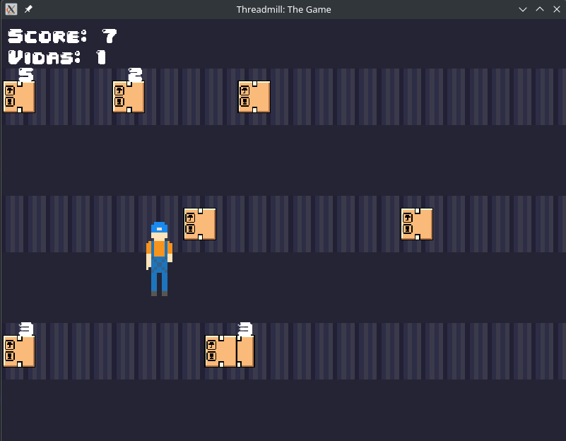

# Threadmill: The Game

## Visão Geral

**Threadmill: The Game** é um projeto desenvolvido para a disciplina de **Sistemas Operacionais I**. O objetivo principal deste trabalho é implementar um jogo que utiliza **threads** e **semaforos** para gerenciar a concorrência e a sincronização entre diferentes componentes do jogo.



## Descrição do Jogo

No **Threadmill: The Game**, o jogador controla um operário que deve coletar pacotes que chegam em três esteiras distintas. Periodicamente, novos pacotes são adicionados às esteiras, mas há apenas um operário disponível para interagir com eles. O operário pode se mover entre as esteiras e coletar os pacotes para evitar que eles alcancem a extremidade esquerda das esteiras.

### Funcionalidades Principais

- **Três Esteiras Independentes:** Cada esteira representa uma linha de chegada de pacotes que o jogador deve monitorar.
- **Gerenciamento de Threads:** Cada esteira opera em sua própria thread, simulando o ambiente concorrente onde múltiplos processos (esteiras) estão ativos simultaneamente.
- **Sincronização com Semáforos:** Semáforos são utilizados para controlar o acesso do operário às esteiras, garantindo que apenas uma esteira esteja ativa por vez.
- **Contagem de Pacotes Empilhados:** Quando múltiplos pacotes se sobrepõem em uma esteira, um número é exibido acima do pacote superior, indicando a quantidade de pacotes empilhados.
- **Sistema de Pontuação e Vidas:** O jogador acumula pontos ao coletar pacotes e perde vidas se os pacotes alcançarem a extremidade esquerda das esteiras.

## Como Jogar

O objetivo do jogo é simples: coletar o máximo de pacotes possível antes que eles escapem pelas esteiras. Gerencie suas ações estrategicamente para maximizar sua pontuação e minimizar a perda de vidas.

### Controles

- **Movimento Horizontal:**
  - **A / Seta Esquerda:** Mover o operário para a esquerda.
  - **D / Seta Direita:** Mover o operário para a direita.
- **Troca de Esteiras:**
  - **W / Seta Cima:** Mover o operário para a esteira superior.
  - **S / Seta Baixo:** Mover o operário para a esteira inferior.
- **Interação com Pacotes:**
  - **Barra de Espaço:** Coletar um pacote na esteira atual.

### Objetivo

- **Coletar Pacotes:** Use a barra de espaço para coletar pacotes que estão alinhados com sua posição na esteira.
- **Evitar Perdas:** Impede que os pacotes cheguem à extremidade esquerda das esteiras. Cada pacote que escapar resulta na perda de uma vida.
- **Pontuação:** Cada pacote coletado incrementa sua pontuação. Pacotes empilhados aumentam a contagem exibida acima deles.

## Instalação

### Pré-requisitos

Antes de compilar e executar o jogo, certifique-se de ter os seguintes componentes instalados em seu sistema:

- **Compilador C++ com Suporte a C++20:** Recomenda-se o `g++` versão 10 ou superior.
- **SFML (Simple and Fast Multimedia Library):** Biblioteca utilizada para gráficos e gerenciamento de janelas.
- **Make (Opcional):** Para facilitar a compilação usando Makefiles.

### Passo a Passo

1. **Clone o Repositório:**

   ```bash
   git clone https://github.com/seu-usuario/threadmill-game.git
   cd threadmill-game
2. **Instale as Dependências:**
   ```bash
   sudo apt-get update
   sudo apt-get install libsfml-dev g++ make
3. **Compilação**
   ```bash
   make all
4. **Execução**
    ```bash
    make run
-----
*Este README foi elaborado para fornecer uma visão abrangente do Threadmill: The Game, facilitando o entendimento, instalação e utilização do jogo. Esperamos que aproveite e contribua para o aprimoramento deste projeto!*